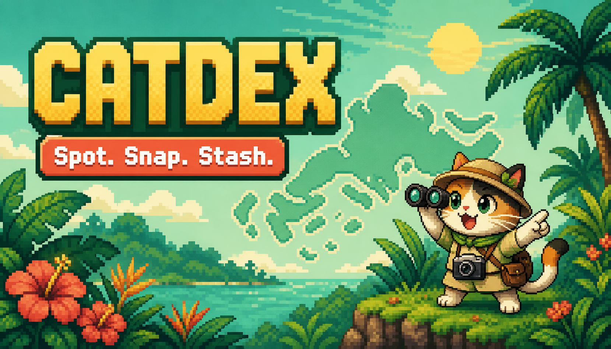
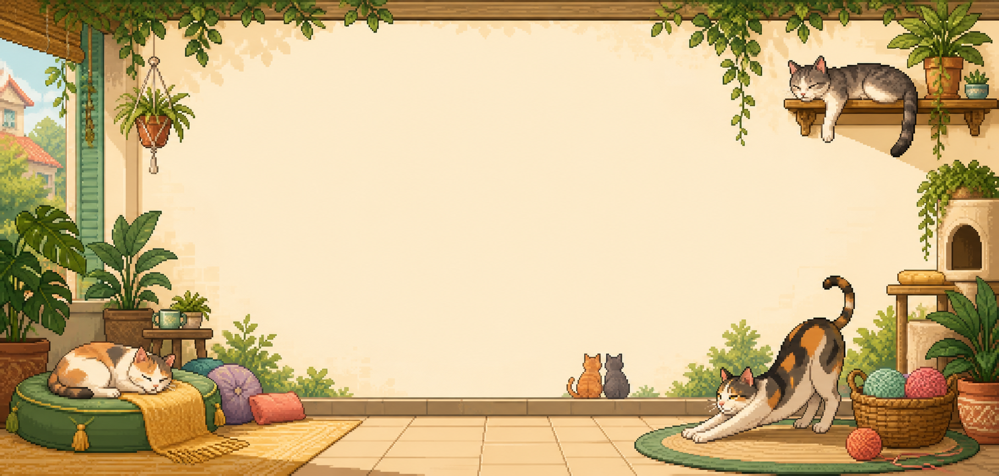
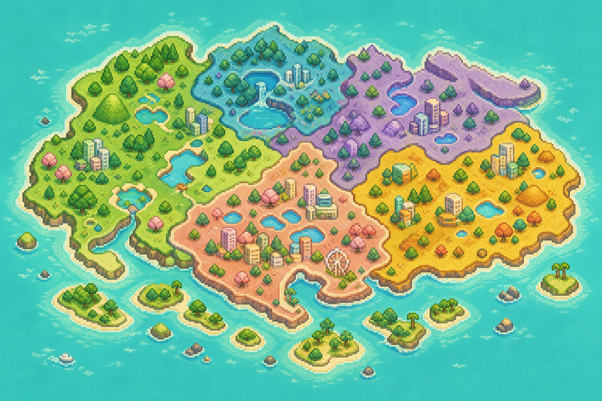

<div align="center">

# CATDEX

### Spot. Snap. Stash.

An illustrated, privacy-first field guide for discovering cats around Singapore.

[](https://shun-ren.github.io/CAT-POKEDEX/)
[](#privacy-by-design)
[](#run-locally)



**[Open the live CATDEX](https://shun-ren.github.io/CAT-POKEDEX/)** · **[Explore the source](https://github.com/shun-ren/CAT-POKEDEX)**

</div>

---

## The idea

CATDEX turns a casual cat sighting into a small, memorable field entry. Choose a photo, let the browser analyse coat and breed clues, add a broad region, and stash the result as a cartoon-style cat card.

It is designed for curious cat spotters, not pedigree certification. The app is a static browser experience: photos are processed locally, and the prototype stores its collection on the current device.

## A visual tour

<table>
<tr>
<td width="50%"></td>
<td width="50%"></td>
</tr>
<tr>
<td align="center"><strong>Cat Fact of the Day</strong><br />A rotating cat curiosity over a readable illustrated lounge.</td>
<td align="center"><strong>CAT Trails</strong><br />Choose a stashed cat and discover six fictional Singapore-inspired stops.</td>
</tr>
</table>

<table>
<tr>
<td width="50%"></td>
<td width="50%"></td>
</tr>
<tr>
<td align="center"><strong>Broad-region map</strong><br />See collection activity without exposing exact locations.</td>
<td align="center"><strong>Miso the cat expert</strong><br />Ask about breeds, coats, behaviour, feeding and community cats.</td>
</tr>
</table>

> The repository does not currently include a video binary. The live demo above is the best way to see the animations, repeated photo analysis, map interactions and CAT Trails movement in motion.

## Feature highlights

| Area | What it does |
| --- | --- |
| **Field Log** | Camera-friendly JPG, PNG and HEIC input with a clear “use another photo” flow. |
| **Cartoon portraits** | Converts uploads into a consistent posterised, outlined CATDEX portrait before saving. |
| **Two-stage analysis** | Separates coat/pattern clues from breed clues, then shows both together, such as `Ginger tabby · Bengal`. |
| **Breed assistance** | Automatically fills the breed estimate; the current browser model is a local ONNX ResNet18 with a visual fallback. |
| **Cat Fact** | Date-seeded daily facts with a “Another fact” button and responsive lounge artwork. |
| **Miso** | A small animated cat chatbot with offline knowledge of common breeds, coats and cat-care topics. |
| **Catdex stash** | Saves names, coat, breed, region, date, portrait and optional field notes as browsable cards. |
| **Map** | Filters the stash by six privacy-safe Singapore regions rather than exact coordinates. |
| **CAT Trails** | A keyboard, click and touch exploration game with six discoverable landmarks and a Golden Paw completion celebration. |
| **Accessible controls** | Keyboard navigation, labelled dialogs, reduced-motion support and sound controls. |

## How a sighting flows

```text
Choose or capture a photo
          |
          v
Local canvas processing  -->  cartoon portrait for the stash
          |
          +--> coat / pattern analysis
          |
          +--> breed model or appearance fallback
          |
          v
Review the combined label, region and field note
          |
          v
Stash it in Catdex  -->  filter it on the map  -->  explore with it in CAT Trails
```

## Privacy by design

- No GPS coordinates, postal codes, street names or exact pins are requested or stored.
- The user chooses one broad region: Central, East, North, North-East, West or Southern Islands.
- Uploaded images are redrawn to a 480 x 480 cartoon-style WebP before prototype storage.
- The prototype uses browser `localStorage`, so the collection stays on that device and browser.
- A production version should add authenticated ownership, deletion/export controls, EXIF checks and server-side privacy safeguards.

## Breed and coat intelligence

CATDEX intentionally treats these as two separate questions:

1. **What does the coat look like?** Examples include tuxedo, tabby, calico, tortoiseshell, ginger, black, blue-grey, colour-point and mostly white.
2. **Which breed is visually plausible?** The breed result is an estimate, not proof of pedigree.

The repository contains a reproducible ML workflow in [`site/ml`](./site/ml): separate breed and coat training scripts, separate evaluation scripts, fixed seed `42`, held-out test reports and candidate ONNX export. The prepared split is backed up as Git LFS archives under [`site/ml/data-archives`](./site/ml/data-archives).

The current browser model is based on Oxford-IIIT Pet and recognises a limited set of cat breeds. Future training should use evidence-backed labels, animal-level train/validation/test separation, balanced classes, macro-F1 and per-breed recall checks, and an “unable to identify reliably” outcome when confidence is weak.

Read the detailed rationale in [`MODEL_TRAINING_STRATEGY.md`](./site/ml/MODEL_TRAINING_STRATEGY.md).

## Future improvements: stronger breed and coat models

The next ML milestone is a more reliable analyser that can distinguish visually similar cats while staying honest about uncertainty.

- Expand the breed dataset with evidence-backed labels from registries, breeders, shelters and veterinary records.
- Add more independent cats, viewpoints, ages, lighting conditions, backgrounds and coat variations for every supported class.
- Improve coat labels so colour, pattern and hair length are recorded as separate, consistent targets.
- Keep breed and coat training as separate models, then combine their outputs only for the user-facing label.
- Use cat detection and cropping for busy photos or images containing more than one cat.
- Use augmentation, class balancing, transfer learning and calibrated confidence to improve generalisation.
- Evaluate with animal-level splits, per-class recall, macro-F1, confusion matrices and a held-out real-world test set.
- Add an explicit unknown or mixed-ancestry result when the evidence is not strong enough for a breed suggestion.
- Promote a new browser model only after it outperforms the previous candidate on the same evaluation protocol.

## Run locally

The app is a static build under `site/build`. No backend is required for the current prototype.

```powershell
cd site
npm install
npm run build
python -m http.server 4173 --directory build
```

Open **http://localhost:4173**.

The browser model and ONNX Runtime files are vendored locally, so image analysis does not need an API key or an image-upload service.

## Publish with GitHub Pages

The repository includes [`.github/workflows/pages.yml`](./.github/workflows/pages.yml). It publishes `site/build` whenever `main` is pushed.

1. Open the repository's **Settings → Pages**.
2. Set **Source** to **GitHub Actions**.
3. Wait for the Pages workflow to turn green in the **Actions** tab.
4. Visit [`https://shun-ren.github.io/CAT-POKEDEX/`](https://shun-ren.github.io/CAT-POKEDEX/).

GitHub Pages is a good fit because this is a static app and the full browser model is larger than some free static-hosting file limits.

## Project structure

```text
CAT-POKEDEX/
├── README.md                         This visual project guide
├── HANDOVER.md                       Continuation notes and known limitations
├── .github/workflows/pages.yml       GitHub Pages deployment
└── site/
    ├── build/                        The browser-ready static app
    │   ├── index.html                 Page structure and dialogs
    │   ├── styles.css                 Responsive visual system
    │   ├── app.js                     State, analysis, chat, map and game logic
    │   ├── assets/                    Pixel-art maps, cats and fact artwork
    │   ├── models/                    Browser breed model and labels
    │   └── vendor/                    ONNX Runtime Web files
    ├── ml/                            Training, evaluation and export workflow
    └── scripts/verify-build.mjs       Dependency-free build verification
```

## Roadmap ideas

- Add an explicit “unknown or mixed ancestry” result when visual evidence is weak.
- Add privacy-safe JSON export/import for moving a stash between devices.
- Connect correction feedback to a reviewed training-data pipeline.
- Publish the full breed model through a host with a suitable asset limit.
- Add more species packs without changing the capture, map or privacy engine.

## Responsible use

CATDEX is a playful field-guide prototype. A visual label should never be treated as verified pedigree, a health diagnosis or a reason to approach an unfamiliar animal. Keep community-cat locations broad, respect owners and caregivers, and do not upload sensitive information.

<div align="center">

**Made for curious cat spotters in Singapore.**

</div>
